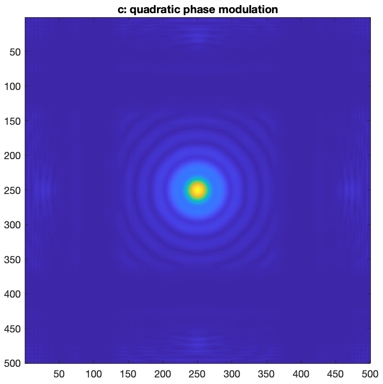
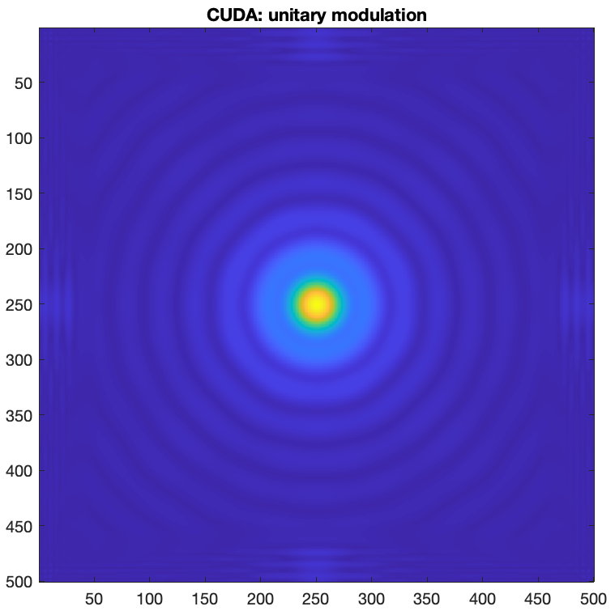
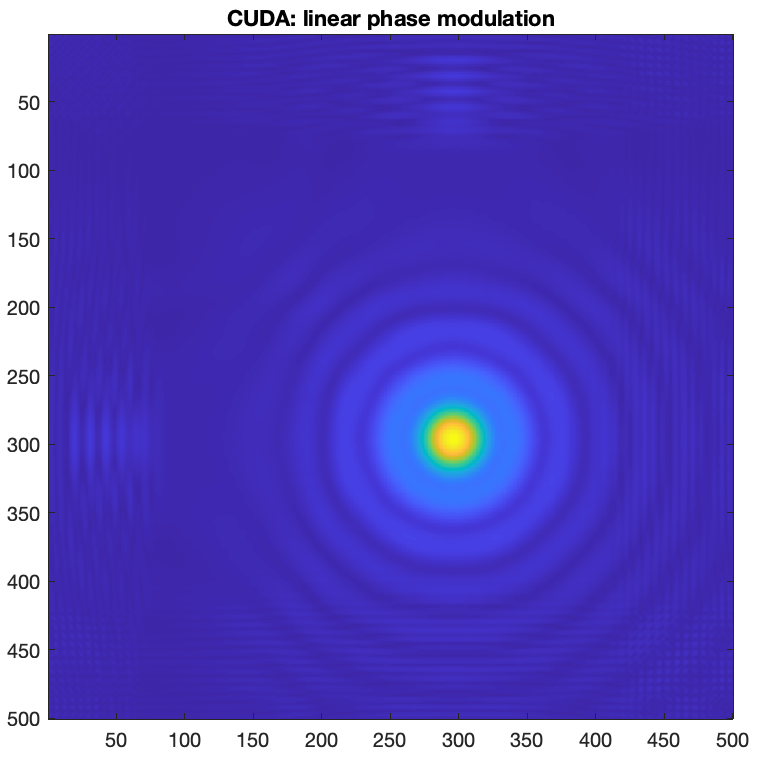

# Paralellization of spatial phase modulation simulation using cuda
This course assignment for Paralell Algorithms and Architectures class implements a simple sequential code simulating the introduction of a phase change to a uniform plane wave exiting a circular aperture. The sequential code was implemented in c language, the GPU paralellization was built using CUDA.

### Assignment specification
- The goal is to compute behaviour of electromagnetic field during propagation through a phase-modulating optical system using GPU.  
- The computation consists of elementwise complex matrix multiplication and 2D FFT and IFFT operations.  
- For aforementioned operations cuBLAS and cuFFT library should be used.
- Simulation scheme:  

  
  

### Implementation  
Sequential implementation: __propagation_in_c.c__   
GPU implementation in CUDA: __propagation_cuda.cu__   

GPU:  NVIDIA T1000 8GB - 896 CUDA cores:  
_Max threads per block: 1024_  
_Max block dimensions: 1024 x 1024 x 64_  
_Max grid dimensions: 2147483647 x 65535 x 65535_  

  
Profiling of the c code has been done with gprof tool. Due to user access issues NVIDIA Nsight tool could not be used for CUDA code profiling. Function-timing using cuda_runtime has been used instead.

### Simulation results     
Both implementations return physically accurate identical results as expected.  
__C code results__

  
  
  

  

__Results obtained by CUDA__

  
  
  

### Performance results
### Conclusion

